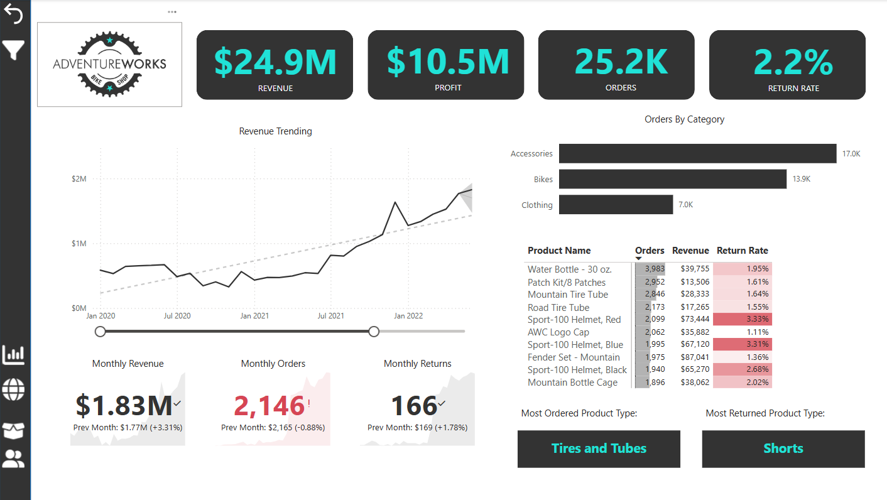

# 🚴 AdventureWorks Power BI Dashboard

A Power BI dashboard project analyzing sales, returns, and customer behavior for **AdventureWorks**, a global cycling equipment manufacturer.

## 🔍 Project Overview

This interactive report provides:
- Key business KPIs: Monthly Revenue, Orders, Profit, Return Rate
- Regional insights through a world map with continent slicer
- Product-level performance vs targets
- Customer segmentation by income and occupation
- Return rate breakdown via a decomposition tree

---

## 📊 Report Pages

1. **Executive Summary** – High-level KPIs, revenue trends, top products
2. **Map View** – Global orders by country with continent filter
3. **Product Details** – Gauges for order, revenue, profit vs targets
4. **Customer Insights** – Trends by customer, segmentation, top customers
5. **Return Analysis** – Decomposition tree of return rate by category

---

## 🧰 Tools & Techniques
- **Power BI**: Visualizations, dashboards, interactivity
- **DAX**: Custom KPIs and calculated measures
- **Power Query**: Data transformation and cleaning
- **Data Modeling**: Fact and dimension tables (Star Schema)

---

## 📁 Project Structure

| File/Folder                         | Description                                  |
|------------------------------------|----------------------------------------------|
| [`AdventureWorks_Dashboard`](https://github.com/abhishek-s-shirol/AdventureWorks-Dashboard/blob/main/AdventureWorks.pbix)| Main Power BI report file                     |
| [`Dataset/`](Dataset)              | Contains customer, sales, product, returns data |
| [`Screenshots/`](Screenshots)      | Images of each dashboard page                |
| [`AdventureWorks_Dashboard_Preview.pdf`](AdventureWorks_Dashboard_Preview.pdf) | Full dashboard as PDF (optional)             |

---

## 🖼️ Dashboard Preview

### Executive Summary  

👉 [Download Full PDF Preview](AdventureWorks_Dashboard_Preview.pdf)

---

## 🙋‍♂️ About Me

I'm a Data Analyst passionate about building impactful dashboards and turning data into actionable insights.  
📬 [Connect with me on LinkedIn](https://www.linkedin.com/in/your-linkedin-handle)

---

